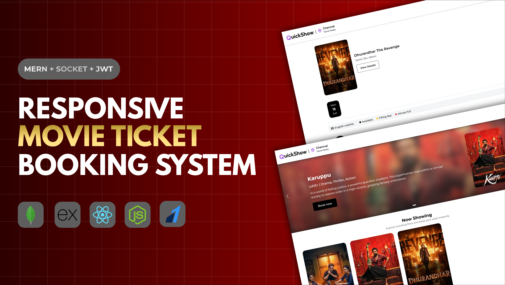
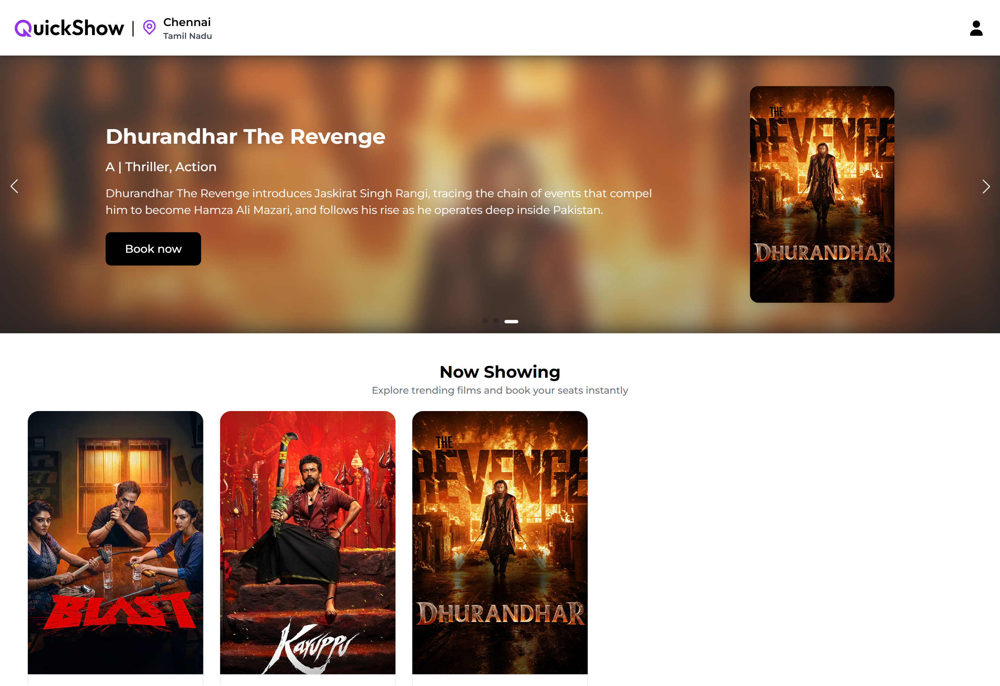
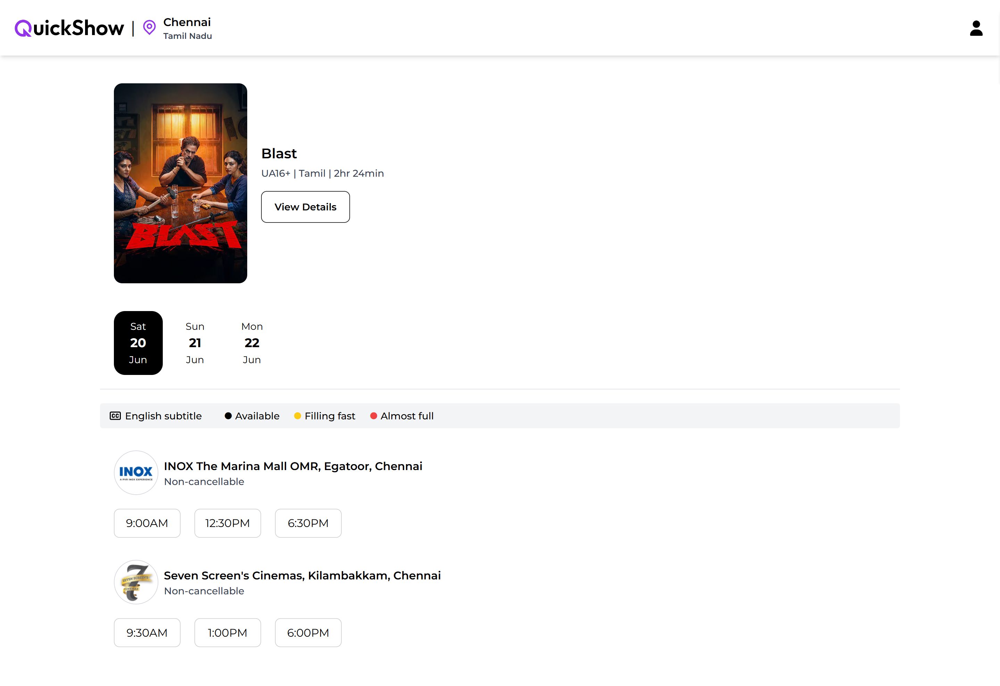
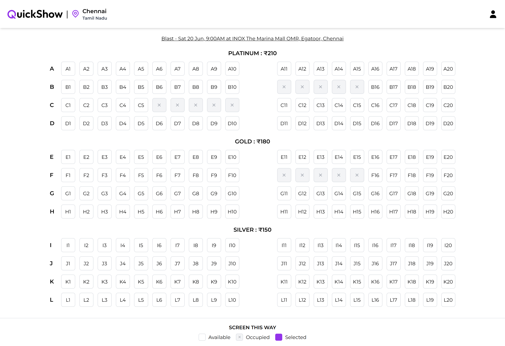
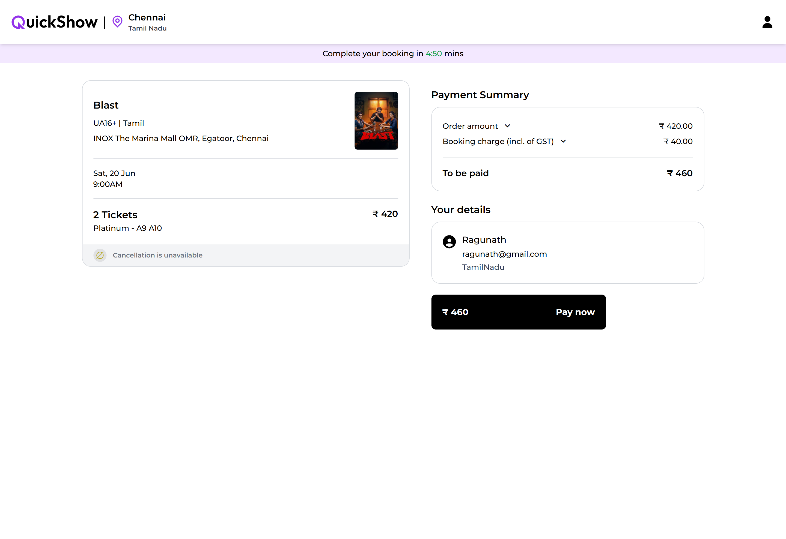
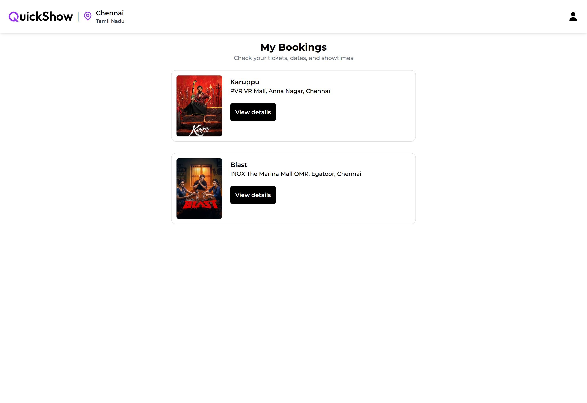

# QuickShow – Movie Ticket Booking System

QuickShow is a full-stack movie ticket booking application built using the MERN stack.
It allows users to browse movies, select seats in real-time, securely book tickets, and track their booking history.

---

**Live Demo :** [QuickShow](https://quickshow-03.vercel.app)

---

## Thumbnail

---

## Preview

### Home Page

### Movie Detail Page

### Seats Selection Page

### Review Booking Page

### My Bookings Page

---

## Features

### Authentication & Authorization
- JWT-based login/signup  
- Secure cookie handling  

### Movie Browsing
- View available movies  
- Detailed movie information page  

### Real-Time Seat Selection
- Live seat availability using Socket.IO  
- Prevents double booking  

### Online Payments
- Integrated Razorpay payment gateway  
- Test mode supported  

### Notifications
- User feedback via react-toastify  

### Responsive UI
- Optimized for mobile and desktop

---

## Tech Stack

### Frontend

* **React.js**
* **React Router**
* **Axios**
* **Socket.IO Client**
* **React Toastify**

### Backend

* **Node.js**
* **Express.js**
* **MongoDB (Mongoose)**
* **Socket.IO**
* **JWT Authentication**

### Other Tools

* **Razorpay (Payment Integration)**
* **dotenv (Environment variables)**
* **cookie-parser & CORS**

---

## Purpose of this Project

This project was built to practice:

* End-to-end full-stack development using the MERN stack.
* Secure user authentication and session management using JWT.
* Real-time communication and concurrency handling with Socket.IO.
* Payment gateway integration using Razorpay.
* Designing scalable backend architecture and RESTful APIs.
* Managing application state and asynchronous operations in React.
* Implementing responsive UI/UX for different screen sizes.
* Handling real-world production challenges (CORS, cookies, browser inconsistencies).

---

## Future Improvements

* Email notifications and booking confirmations.
* Admin dashboard for managing movies, shows, and users.
* Location-based movie and theatre recommendations.
* Social authentication (Google & Apple OAuth login).

---

## Author

**Ragunath S**

GitHub: https://github.com/Ragunath-1014

---

⭐ If you like this project, consider giving it a **star** on GitHub!
